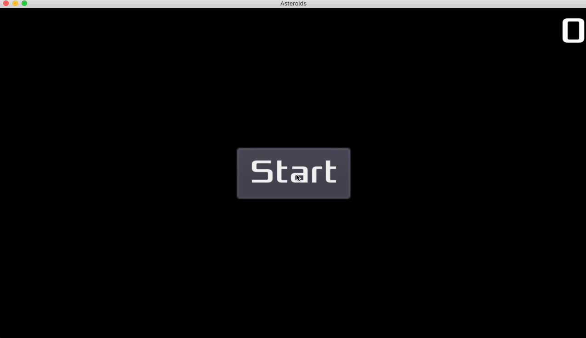

## Asteroids!
*Asteroids!* is my attempt to create a clone of the classic Atari game *Asteroids* released in 1979. This project uses the Godot engine and is my first try at game development.

### Build or Install
You can import, edit, and build the game yourself with [Godot 3.1](https://godotengine.org/download). After cloning the repo select `Import` in Godot and select the `project.godot` file. You can then run the game inside the editor or export it as an executable for your desired platform.

If you're on MacOS you can download a .dmg file of the game by going to the [Releases](https://github.com/haaspt/asteroids/releases) page.
